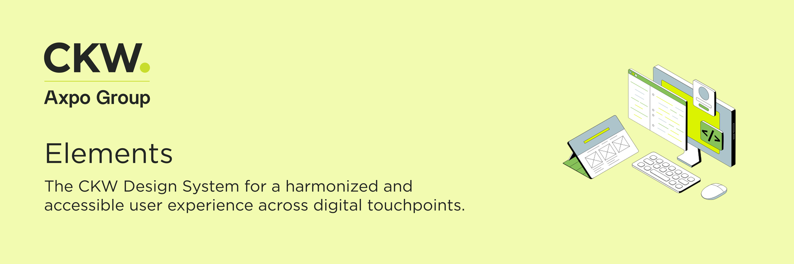

<div align="center">



# CKW Elements

**Design tokens and component library for CKW AG**

[](./LICENSE)
[](https://nodejs.org)
[](https://pnpm.io)
[](https://ckwag.github.io/ckw-elements/)

[Live Documentation](https://ckwag.github.io/ckw-elements/) · [Architecture](./ARCHITECTURE.md) · [Contributing](#contributing)

</div>

---

## Overview

CKW Elements is a design system that bridges Figma and code. Tokens are authored as Figma Variables, exported via Tokens Studio, and transformed into **CSS Custom Properties**, **JavaScript modules**, and **TypeScript declarations** through Style Dictionary v4.

The result: a single source of truth for colors, typography, spacing, borders, shadows, and React components that can be consumed directly from npm packages.

## What's Included

| Package                                             | Status     | Description                                                 |
| --------------------------------------------------- | ---------- | ----------------------------------------------------------- |
| [`@ckw-elements/tokens`](./packages/tokens)         | ✅ Active  | 282 design tokens (CSS + JS)                                |
| [`@ckw-elements/components`](./packages/components) | ✅ Active  | React component library (ESM + types + CSS)                 |
| [`@ckw-elements/icons`](./packages/icons)           | 📋 Planned | Icon set                                                    |
| [`@ckw-elements/storybook`](./apps/storybook)       | ✅ Active  | [Documentation site](https://ckwag.github.io/ckw-elements/) |

## Quick Start

```bash
git clone https://github.com/CKWAG/ckw-elements-design.git
cd ckw-elements-design
pnpm install
pnpm --filter @ckw-elements/storybook run dev
```

> **Prerequisites:** Node.js >= 20, pnpm >= 10

Storybook opens at [localhost:6006](http://localhost:6006) with the full token documentation.

## React Usage

Install the packages in any React application:

```bash
npm install @ckw-elements/tokens @ckw-elements/components
```

Import token CSS once in your app entry point:

```css
@import '@ckw-elements/tokens/tokens.css';
```

Then import components directly:

```tsx
import React from 'react';
import { Button, InlineMessage, InputField, SegmentedControl } from '@ckw-elements/components';

export function Example() {
  return (
    <form>
      <InlineMessage status="Info" title="Statusmeldung">
        Hier steht eine kurze Erklaerung zum aktuellen Status oder zur naechsten Aktion.
      </InlineMessage>
      <InputField label="Name" placeholder="Enter name" />
      <SegmentedControl
        segments={[
          { value: 'monthly', label: 'Monthly' },
          { value: 'yearly', label: 'Yearly' },
        ]}
        activeValue="monthly"
      />
      <Button type="Primary">Save</Button>
    </form>
  );
}
```

The package also exposes an explicit React subpath:

```tsx
import { Button } from '@ckw-elements/components/react';
```

If a bundler does not process CSS side-effect imports from packages, import component CSS explicitly:

```css
@import '@ckw-elements/components/styles.css';
```

## Token Usage

Import the token CSS file into your project:

```css
@import '@ckw-elements/tokens/tokens.css';
```

Then use semantic tokens in your styles:

```css
.card {
  background: var(--background-default);
  color: var(--text-primary);
  border: var(--border-weight-s) solid var(--border-soft);
  border-radius: var(--border-radius-s);
  padding: var(--spacing-l);
  box-shadow: var(--shadow-s);
}

.card:hover {
  border-color: var(--border-hover);
}
```

> **Rule:** Always use semantic tokens (`--interactive-primary`), never primitives (`--color-green-600`). This enables theming and ensures consistency.

Token values can also be imported from JavaScript:

```ts
import tokens, { interactivePrimary, spacingM } from '@ckw-elements/tokens';
import rawTokens from '@ckw-elements/tokens/tokens.json';
```

## AI Agent Support

The repository includes [AGENTS.md](./AGENTS.md) for coding agents. The deployed Storybook also exposes plain-text resources that are easier for agents to fetch than a rendered browser UI:

- `llms.txt` — short entrypoint
- `llms-full.txt` — package usage, component APIs, and rules
- `tokens/tokens.css`, `tokens/tokens.js`, `tokens/tokens.json` — generated token assets
- `skills/ckw-prototyping.md` and `skills/ckw-components.md` — reusable agent prompts

Storybook itself builds as a static web application. It is not server-side rendered per documentation route; for agent workflows, use the static files above and Storybook's generated `index.json` for story metadata.

## Token Architecture

```
Figma Variables
  └─ Tokens Studio ──▸ tokens-raw.json
                              │
                    transform-tokens.mjs
                              │
                              ▾
                        tokens.json (DTCG)
                              │
                     Style Dictionary v4
                              │
                  ┌───────────┴───────────┐
                  ▾                       ▾
            tokens.css              tokens.js
```

Tokens are organized in two layers:

- **Primitive** — Raw values (79 colors, 15 spacing, 7 radii, etc.)
- **Semantic** — Purpose-driven references (`--interactive-primary`, `--text-secondary`, etc.)

See [ARCHITECTURE.md](./ARCHITECTURE.md) for full pipeline details.

## Scripts

| Command                                            | Description                             |
| -------------------------------------------------- | --------------------------------------- |
| `pnpm install`                                     | Install dependencies                    |
| `pnpm tokens:sync`                                 | Full token pipeline (transform + build) |
| `pnpm --filter @ckw-elements/components run build` | Build React component package           |
| `pnpm format`                                      | Format code (Prettier)                  |
| `pnpm format:check`                                | Check formatting (CI)                   |
| `pnpm --filter @ckw-elements/storybook run dev`    | Start Storybook                         |
| `pnpm --filter @ckw-elements/storybook run build`  | Build Storybook                         |
| `pnpm -r run build`                                | Build all packages                      |
| `pnpm changeset`                                   | Add package release intent              |
| `pnpm release:validate`                            | Validate build, release metadata, pack  |

## Tech Stack

| Tool                                                          | Purpose                  |
| ------------------------------------------------------------- | ------------------------ |
| [pnpm](https://pnpm.io)                                       | Monorepo package manager |
| [Style Dictionary 4](https://amzn.github.io/style-dictionary) | Token transformation     |
| [React 19](https://react.dev)                                 | Component framework      |
| [TypeScript 5](https://www.typescriptlang.org)                | Type safety              |
| [Storybook 10](https://storybook.js.org)                      | Documentation            |
| [Vite 6](https://vite.dev)                                    | Build tool               |
| [Prettier](https://prettier.io)                               | Code formatting          |

## Contributing

We welcome contributions! Here's how to get started:

1. Clone and install (see [Quick Start](#quick-start))
2. Create a feature branch from `main`
3. Make your changes — Prettier runs automatically on commit via Husky
4. Verify visually in Storybook
5. Open a Pull Request

### Adding a Component

```
packages/components/src/ComponentName/
├── ComponentName.tsx          # React component (semantic tokens only)
├── ComponentName.stories.tsx  # Interactive stories
└── ComponentName.mdx          # Documentation page
```

### Code Style

- 2-space indent, single quotes, semicolons, trailing commas
- `interface` for props (never `type`)
- Named exports, PascalCase filenames
- `import React from 'react'` required in all TSX files

### Token Changes

1. Export from Tokens Studio → save to `packages/tokens/tokens-raw.json`
2. Run `pnpm tokens:sync`
3. Verify in Storybook
4. Commit

## Project Structure

```
ckw-elements-design/
├── packages/
│   ├── tokens/              282 design tokens (CSS + JS output)
│   ├── components/          React component library
│   └── icons/               Icon set (planned)
├── apps/
│   └── storybook/           Documentation site
├── ARCHITECTURE.md          Full technical reference
├── PIPELINE.md              Designer-facing guide (German)
└── AGENTS.md                AI agent reference
```

## Further Reading

- **[Live Documentation](https://ckwag.github.io/ckw-elements/)** — Browse tokens and components interactively
- **[ARCHITECTURE.md](./ARCHITECTURE.md)** — Pipeline spec, Style Dictionary config, data flow
- **[PIPELINE.md](./PIPELINE.md)** — Non-technical guide for designers (German)
- **[RELEASE.md](./RELEASE.md)** — Versioning, release validation, and npm publishing process

## License

Licensed under the [Apache License, Version 2.0](./LICENSE).

**Excluded from the open-source license** (see [NOTICE](./NOTICE)):

| Asset                                  | Reason                                                 |
| -------------------------------------- | ------------------------------------------------------ |
| `apps/storybook/public/ckw-logo.svg`   | CKW AG trademark                                       |
| `apps/storybook/public/fonts/Gotham-*` | Commercial font ([Monotype](https://www.monotype.com)) |
